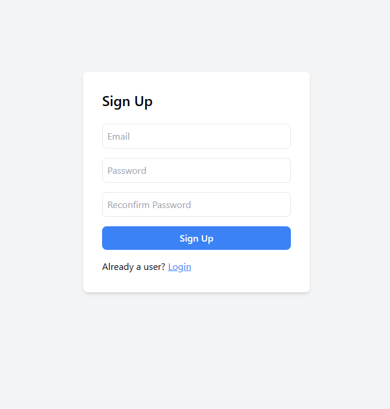

# GriphyApp

GriphyApp is a Next.js application designed with Firebase Authentication and GIPHY API integration. The primary feature of this application is a GIF search functionality powered by the GIPHY API. Users can search for GIFs, view them in a gallery format, and mark their favorite GIFs. The application also offers additional features like hot searching and loading animations.

## Screenshots

### Login


### Sign Up


### Home


### Favourite


## Features

### Firebase Authentication
- Users can log in using their email and password or sign up for a new account.

### GIF Search and Gallery
- Search for GIFs using the GIPHY API and view them in a gallery format.

### Marking Favorites
- Users can mark individual GIFs as favorites and view them in a dedicated section on the home page.

### Hot Search
- GIFs update dynamically as the user types, eliminating the need to press a search button.

### Loading Animations
- Enhance the user experience with loading animations during data fetching.
  
## Getting Started

### Prerequisites
- Node.js v14 or higher
- Firebase account for authentication setup

### Installation
1. Clone the repository:
   ```bash
   git clone https://github.com/hs0047/GriphyApp.git
   
2. Navigate to the project directory:
   ```bash
   cd GriphyApp
   
3. Install the required dependencies:
   ```bash
    npm install
   
4. Start the application:
   ```bash
    npm start
## Usage

- **Authentication**: 
  - Log in using your email and password or sign up for a new account.
  
- **Search GIFs**: 
  - Enter your desired keywords in the search bar to view a gallery of GIFs.
  
- **Mark Favorites**: 
  - Click on the favorite icon on individual GIFs to add them to your favorites.
  
- **View Favorites**: 
  - Navigate to the "favorites" section on the home page to view your selected GIFs.
    
## Contributing

Pull requests are welcome. For major changes, please open an issue first to discuss what you would like to change. Ensure you follow the project's code style and run tests if applicable before submitting a pull request.

## License

This project is licensed under the MIT License. See the [LICENSE](LICENSE) file for details.

